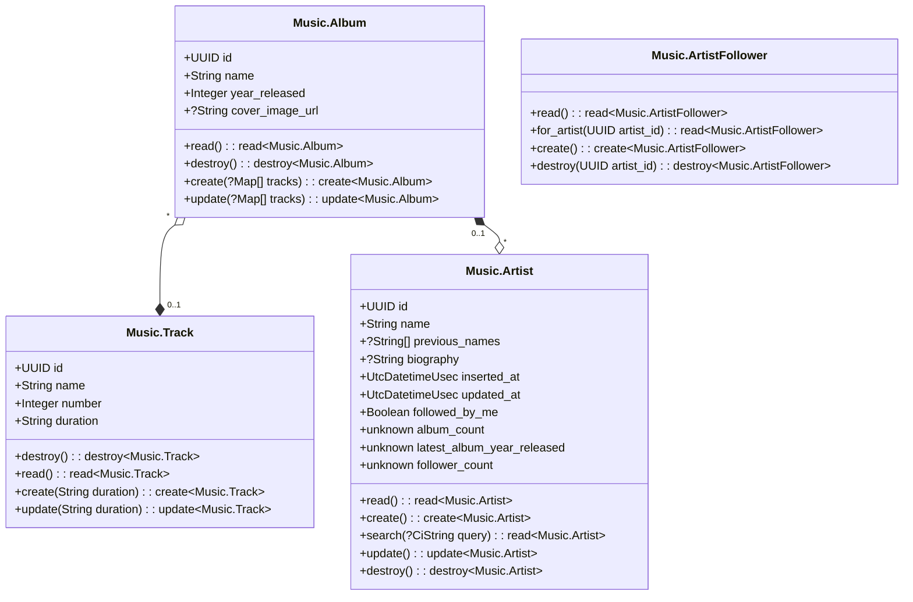
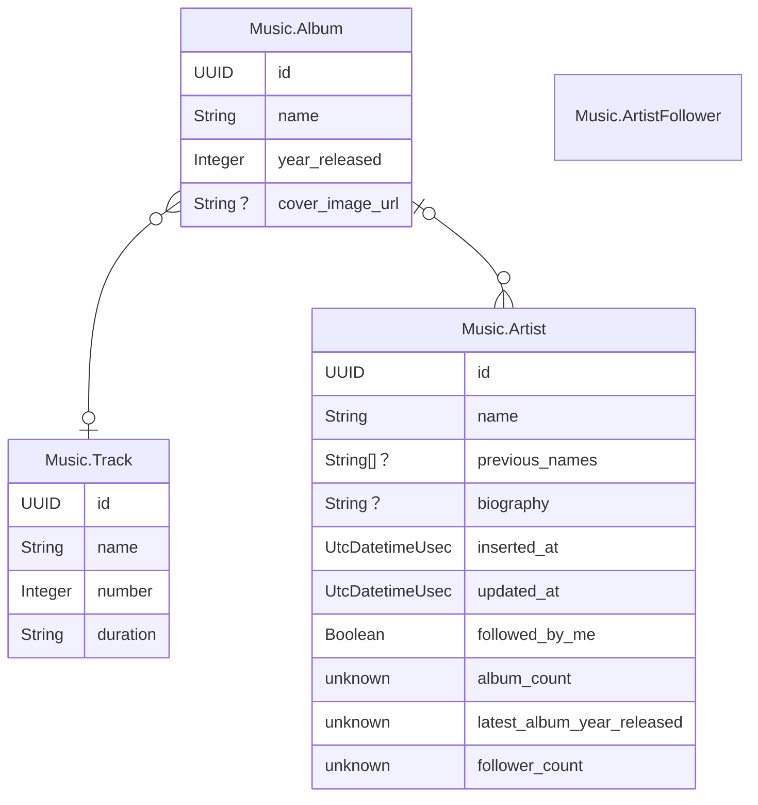
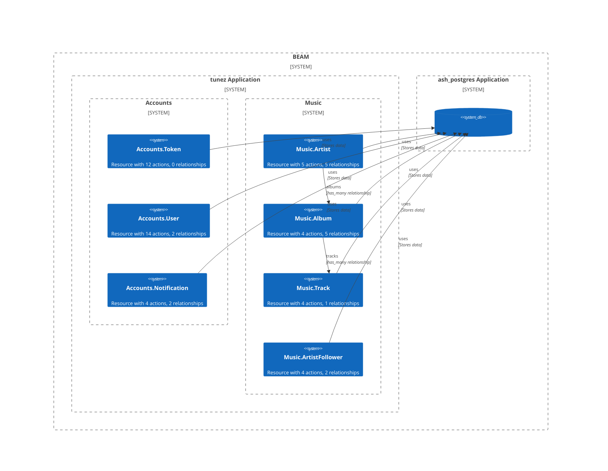
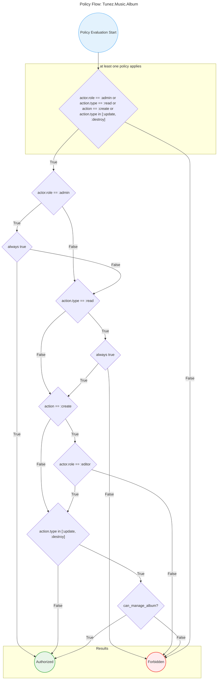

<!-- ex_doc_ignore_start -->
# AshDiagram
<!-- ex_doc_ignore_end -->

**AshDiagram** is an Elixir library for generating beautiful, interactive diagrams to visualize your [Ash Framework](https://ash-hq.org/) applications. Generate Entity Relationship diagrams, Class diagrams, C4 Architecture diagrams, and Policy flowcharts directly from your Ash resources and domains.

## Features

- 🔗 **Entity Relationship Diagrams** - Visualize relationships between your Ash resources
- 📦 **Class Diagrams** - Show the structure of your resources with attributes and relationships
- 🏗️ **C4 Architecture Diagrams** - Display system architecture at different abstraction levels
- 🔐 **Policy Diagrams** - Understand authorization flows with flowchart representations
- 🎨 **Multiple Output Formats** - Render to PNG, SVG, or Mermaid markdown
- ⚡ **Clarity Integration** - Works seamlessly with the Clarity introspection framework
- 🔄 **Automatic Generation** - Generate diagrams at application, domain, and resource levels

## Supported Diagram Types

### Entity Relationship Diagrams
Generate ER diagrams showing your resources and their relationships:
- Resource entities with attributes
- Relationship cardinalities
- Foreign key relationships

### Class Diagrams
Create UML-style class diagrams of your resources:
- Resource attributes and types
- Methods (actions)
- Inheritance and composition relationships

### C4 Architecture Diagrams
Visualize system architecture using the C4 model:
- Context diagrams showing system boundaries
- Container diagrams showing high-level technology choices
- Component diagrams showing internal structure

### Policy Flowcharts
Understand authorization logic through flowchart diagrams:
- Policy conditions and rules
- Decision trees and access controls
- Authorization flow visualization

## Installation

Add `ash_diagram` to your list of dependencies in `mix.exs`:

```elixir
def deps do
  [
    {:ash_diagram, "~> 0.1.0"}
  ]
end
```

For rendering capabilities, you'll also want to include optional dependencies:

```elixir
def deps do
  [
    {:ash_diagram, "~> 0.1.0"},
    {:ex_cmd, "~> 0.15.0"},  # For CLI rendering
    {:req, "~> 0.5.15"}      # For Mermaid.ink rendering
  ]
end
```

## Usage

### Basic Usage

Generate and render diagrams programmatically:

```elixir
# Generate an Entity Relationship diagram for a domain
diagram = AshDiagram.Data.EntityRelationship.for_domains([MyApp.Accounts])
mermaid_code = AshDiagram.compose(diagram)

# Render to PNG
png_data = AshDiagram.render(diagram, format: :png)
File.write!("diagram.png", png_data)
```

### Integration with Clarity

AshDiagram includes a [`clarity`](https://hex.pm/packages/clarity) introspector that automatically generates diagrams for your Ash applications.

### Renderer Configuration

AshDiagram automatically detects and uses available renderers. You can configure a specific renderer in your application config:

```elixir
# config/config.exs
config :ash_diagram, :renderer, AshDiagram.Renderer.CLI
# or
config :ash_diagram, :renderer, AshDiagram.Renderer.MermaidInk
```

#### Built-in Renderers

**CLI Renderer** (requires `ex_cmd` and `mmdc` command in PATH):
- Uses local Mermaid CLI installation
- Supports PNG, SVG, and PDF formats
- Best for server environments with Node.js installed

**Mermaid.ink Renderer** (requires `req`):
- Uses the online Mermaid.ink service
- Supports SVG and PNG formats
- Best for development and when CLI tools aren't available

#### Custom Renderers

You can implement custom renderers by implementing the `AshDiagram.Renderer` behaviour:

```elixir
defmodule MyApp.CustomRenderer do
  @behaviour AshDiagram.Renderer

  @impl true
  def supported?(), do: true

  @impl true
  def render(diagram, options) do
    # Your custom rendering logic
  end
end

# Configure it
config :ash_diagram, :renderer, MyApp.CustomRenderer
```

#### Diagram Extensions

You can extend generated diagrams with custom data by implementing the `AshDiagram.Data.Extension` behaviour. This allows you to add additional elements to any diagram type.

```elixir
defmodule MyApp.DiagramExtension do
  @behaviour AshDiagram.Data.Extension

  use Spark.Dsl.Extension

  @impl AshDiagram.Data.Extension
  def supports?(AshDiagram.Data.Architecture), do: true
  def supports?(_creator), do: false

  @impl AshDiagram.Data.Extension
  def extend_diagram(AshDiagram.Data.Architecture, %AshDiagram.C4{} = diagram) do
    # Add custom element to C4 architecture diagrams
    custom_element = %AshDiagram.C4.Element{
      type: :system,
      external?: true,
      alias: "external_system",
      label: "External System"
    }
    %{diagram | entries: [custom_element | diagram.entries]}
  end
end
```

**Extension Discovery**: Extensions are discovered by adding them to your Ash domains and resources:

```elixir
# Add to domain
defmodule MyApp.Accounts do
  use Ash.Domain,
    extensions: [MyApp.DiagramExtension]

  resources do
    resource MyApp.Accounts.User
  end
end

# Add to specific resources
defmodule MyApp.Accounts.User do
  use Ash.Resource,
    domain: MyApp.Accounts,
    extensions: [MyApp.DiagramExtension]

  # ... resource definition
end
```

Extensions are automatically collected from all domains and resources when generating diagrams.

## Examples

### Entity Relationship Diagram

```elixir
alias AshDiagram.Data.EntityRelationship

# Generate for specific domains
diagram = EntityRelationship.for_domains([MyApp.Accounts, MyApp.Blog])

# Generate for entire application
diagram = EntityRelationship.for_applications([:my_app])

# Render as PNG
png_data = AshDiagram.render(diagram, format: :png)
```

### Class Diagram

```elixir
alias AshDiagram.Data.Class

# Generate class diagram
diagram = Class.for_domains([MyApp.Accounts])
svg_data = AshDiagram.render(diagram, format: :svg)
```

### Architecture Diagram

```elixir
alias AshDiagram.Data.Architecture

# Generate C4 architecture diagram
diagram = Architecture.for_applications([:my_app])
markdown = AshDiagram.compose_markdown(diagram)
```

### Policy Diagram

```elixir
alias AshDiagram.Data.Policy

# Generate policy flowchart for a resource
diagram = Policy.for_resource(MyApp.Accounts.User)
mermaid = AshDiagram.compose(diagram)
```

### Optional Dependencies

- `ex_cmd ~> 0.15.0` - Required for CLI rendering
- `req ~> 0.5.15` - Required for Mermaid.ink rendering
- `clarity ~> 0.1.2` - For automatic diagram generation integration

## Contributing

Contributions are welcome! Please feel free to submit a Pull Request.

## Links

- [Documentation](https://hexdocs.pm/ash_diagram)
- [Ash Framework](https://ash-hq.org/)
- [Mermaid.js](https://mermaid.js.org/)
- [C4 Model](https://c4model.com/)

## Example Diagrams

Examples taken from the [`tunez`](https://github.com/sevenseacat/tunez) starter
app of the [Ash Framework](https://pragprog.com/titles/ldash/ash-framework/)
book.

<!-- tabs-open -->

### Class




### Entity Relationship



### C4 Architecture



### Resource Policy



<!-- tabs-close -->

## License

Copyright 2025 Alembic Pty Ltd

Licensed under the Apache License, Version 2.0 (the "License");
you may not use this file except in compliance with the License.
You may obtain a copy of the License at

    http://www.apache.org/licenses/LICENSE-2.0

Unless required by applicable law or agreed to in writing, software
distributed under the License is distributed on an "AS IS" BASIS,
WITHOUT WARRANTIES OR CONDITIONS OF ANY KIND, either express or implied.
See the License for the specific language governing permissions and
limitations under the License.
